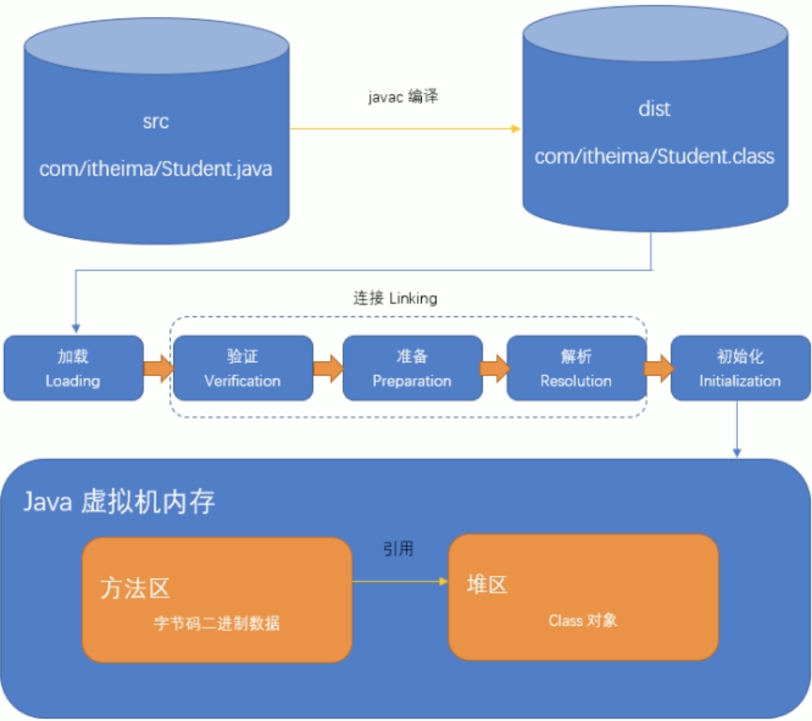
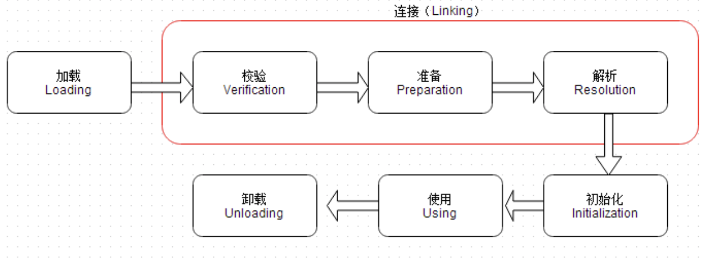
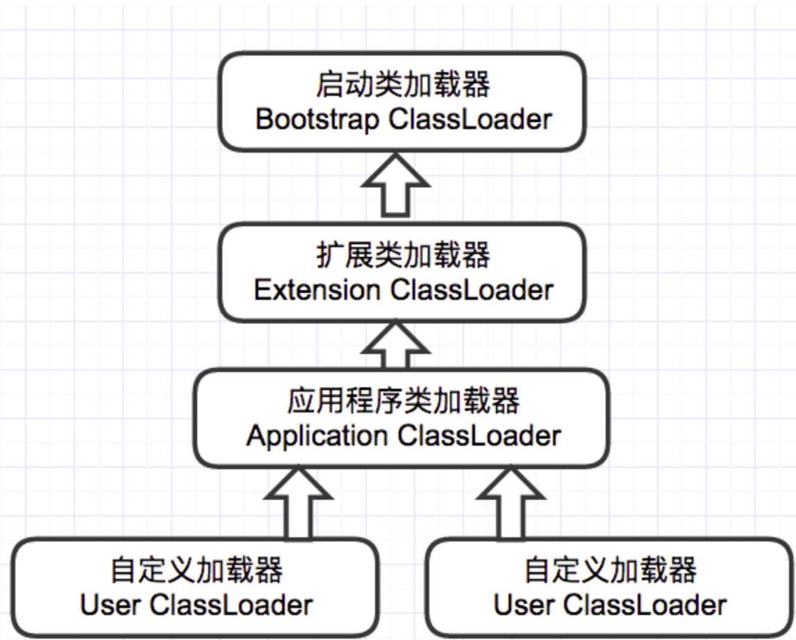

# JVM

## 类加载机制

#### 1.类加载器



​	我们写的java代码都是以.java结尾的java源代码，这部分代码是存放在磁盘中的，他里面存储着程序要执行的逻辑，要想使用这段代码，首先必须通过javac编译器编译成字节码文件，字节码文件也是存储在磁盘中的。字节码文件存放着需执行指令的二进制信息。要想使用class文件，第一步是必须加载要内存中。一个类的生命周期就是从类的加载、连接、初始化开始的。

​	从磁盘上将class文件加载到虚拟机中，这就需要用到类加载器。加载到内存中之后，才可以使用java程序。java虚拟机内存分为方法区和堆区，方法区存放字节码二进制数据信息，在堆区会生成class对象来引用字节码二进制数据

#### 2.过程（类的生命周期）

​	当java程序中需要使用到某个类时，虚拟机会保证这个类已经被加载，连接和初始化，而连接又包括验证、准备和解析这三个子过程，这个过程必须严格的按照顺序执行。所以有时也把这个3个步骤统称为类加载或类初始化。



##### 2.1类的加载

​	通过类的完全限定名（包名和类名）查找到此类的字节码文件，把类的.class文件中的二进制数据读入到内存中，并存放在运行时数据区的方法区内。然后利用字节码文件创建一个Class对象，用于封装类在方法区内的数据结构并存放在堆内。

​	这个过程是由类加载器完成的。

##### 2.2连接

- ​	验证：确保被类加载的正确性。class文件中的字节流中包含的信息符合当前虚拟机的要求，不会危害虚拟机自身安全。
- ​	准备：为类的静态变量分配内存，并将其初始化为默认值。此阶段仅仅只为静态类变量（即static修饰的字段变量）分配内存，并且设置该变量的初始值。（比如static int num =5,这里只将num初始化为0，5的值将会在初始化时赋值）。对于final static修饰的变量，编译的时候就会分配了，也不会分配实例变量的内存。
- ​	解析：把类中的符号引用转换为直接引用。符号引用就是一组符号来描述目标，而直接引用就是直接目标的指针、相对偏移量或一个间接定位到目标的句柄。

##### 2.3初始化

​	类加载的最后阶段。若该类具有父类，类加载器将先会加载父类的字节码并进行初始化，执行静态变量赋值和静态代码块，那成员变量也会被初始化。

​	初始化阶段是执行类构造器<client>方法的过程。<client>方法是由编译器自动收集类中的类变量的赋值操作和静态语句块中的语句合并而成的。虚拟机会保证<client>方法执行之前，父类的<client>方法已经执行完毕。如果一个类中没有对静态变量赋值也没有静态语句块，那么编译器可以不为这个类生成<client>()方法。

​	java中，对于初始化阶段，有且只有以下五种情况才会对要求类立刻“初始化”（加载，验证，准备，自然需要在此之前开始）：

1. 使用new关键字实例化对象、访问或者设置一个类的静态字段（被final修饰、编译器优化时已经放入常量池的例外）、调用类方法，都会初始化该静态字段或者静态方法所在的类。
2. 初始化类的时候，如果其父类没有被初始化过，则要先触发其父类初始化。
3. 使用java.lang.reflect包的方法进行反射调用的时候，如果类没有被初始化，则要先初始化。
4. 虚拟机启动时，用户会先初始化要执行的主类（含有main）
5. jdk 1.7后，如果java.lang.invoke.MethodHandle的实例最后对应的解析结果是 REF_getStatic、REF_putStatic、REF_invokeStatic方法句柄，并且这个方法所在类没有初始化，则先初始化。

所以一个类的加载会经过这三个阶段。

#### 3.类加载器

​	把类加载阶段的“通过一个类的全限定名来获取描述此类的二进制字节流”这个动作交给虚拟机之外的类加载器来完成。这样的好处在于，我们可以自行实现类加载器来加载其他格式的类，只要是二进制字节流就行，这就大大增强了加载器灵活性。系统自带的类加载器分为三种：

1. 启动类加载器。
2. 扩展类加载器。
3. 应用程序类加载器。

#### 4.双亲委派机制



双亲委派机制工作过程：

​	如果一个类加载器收到了类加载器的请求.它首先不会自己去尝试加载这个类.而是把这个请求委派给父加载器去完成.每个层次的类加载器都是如此.因此所有的加载请求最终都会传送到Bootstrap类加载器(启动类加载器)中.只有父类加载反馈自己无法加载这个请求(它的搜索范围中没有找到所需的类)时.子加载器才会尝试自己去加载。

双亲委派模型的优点：java类随着它的加载器一起具备了一种带有优先级的层次关系.

​	例如类java.lang.Object,它存放在rt.jart之中.无论哪一个类加载器都要加载这个类.最终都是双亲委派模型最顶端的Bootstrap类加载器去加载.因此Object类在程序的各种类加载器环境中都是同一个类.相反.如果没有使用双亲委派模型.由各个类加载器自行去加载的话.如果用户编写了一个称为“java.lang.Object”的类.并存放在程序的ClassPath中.那系统中将会出现多个不同的Object类.java类型体系中最基础的行为也就无法保证.应用程序也将会一片混乱.


#### 5.类的生命周期（简化版）

​	

- 加载，查找并加载类的二进制数据，在Java堆中也创建一个java.lang.Class类的对象
- 连接，连接又包含三块内容：验证、准备、初始化。 1）验证，文件格式、元数据、字节码、符号引用验证； 2）准备，为类的静态变量分配内存，并将其初始化为默认值； 3）解析，把类中的符号引用转换为直接引用
- 初始化，为类的静态变量赋予正确的初始值
- 使用，new出对象程序中使用
- 卸载，执行垃圾回收


## 内存溢出

#### 1.什么是内存溢出

​	当程序需要申请内存的时候，由于没有足够的内存，此时就会抛出OutOfMemoryError，这就是内存溢出。

#### 2.内存泄漏和内存溢出区别与联系

- 内存泄漏：系统分配的内存没有被回收。

- 内存溢出：分配的内存空间超过系统内存。

#### 3.内存泄漏的原因分析

​	jvm由5大块组成：堆，栈，本地方法栈，程序计数器，方法区。栈它的主要记录方法的执行和对象的引用。堆则存在真正的引用的对象。

内存泄漏是由于使用不当，把一部分内存“丢掉了”，导致这部分内存不可用。

当在堆中创建了对象，后来没有使用这个对象了，又没有把整个对象的相关引用设为null。此时垃圾收集器会认为这个对象是需要的，就不会清理这部分内存。这就会导致这部分内存不可用。

所以内存泄漏会导致可用的内存减少，进而会导致内存溢出。

#### 4.JVM垃圾回收机制思想

就是从栈出发（root），遍历对象的引用，在遍历堆里面的引用对象，因为栈中的对象的引用执行完毕就删除，所以我们就可以通过栈中的对象的引用，查找到堆中没有被指向的对象，这些对象即为不可到达对象，对其进行垃圾回收。

【栈中的对象的引用执行完毕就删除】理解：

原本在方法区内声明并创建的对象，它的有效范围应该只限于这个方法，方法运行结束，方法内对象的“生命周期”也应结束，占用的内存理论上就不再属于这些对象。但由于java通过垃圾回收，自动管理内存中创建的对象，那么在方法内创建的对象，其“生命期”不一定就只限于这个方法，只要它被外部引用，则会在方法结束后继续“存活”（即：java虚拟机继续保留这个内存给这个对象使用），直到那个引用它的外部因素“死亡”


#### 5.内存溢出的原因分析

​	内存溢出是由于没被引用的对象（垃圾）过多造成JVM没有及时回收，造成的内存溢出。如果出现这种现象可行代码排查：

1. 是否App中的类中和引用变量过多使用了Static修饰 如public staitc Student s；在类中的属性中使用 static修饰的最好只用基本类型或字符串。如public static int i = 0; //public static String str;
2. 是否App中使用了大量的递归或无限递归（递归中用到了大量的建新的对象）
3. 是否App中使用了大量循环或死循环（循环中用到了大量的新建的对象）
4. 检查App中是否使用了向数据库查询所有记录的方法。即一次性全部查询的方法，如果数据量超过10万多条了，就可能会造成内存溢出。所以在查询时应采用“分页查询”。
5. 检查是否有数组，List，Map中存放的是对象的引用而不是对象，因为这些引用会让对应的对象不能被释放。会大量存储在内存中。
6. 检查是否使用了“非字面量字符串进行+”的操作。因为String类的内容是不可变的，每次运行"+"就会产生新的对象，如果过多会造成新String对象过多，从而导致JVM没有及时回收而出现内存溢出。

```
String s1 = "My name";
String s2 = "is";
String s3 = "xiaomanong";
String str = s1 + s2 + s3 +.........;
```

这是会容易造成内存溢出的

但是String str = "My name" + " is " + " xuwei" + " nice " + " to " + " meet you"; //但是这种就不会造成内存溢出。因为这是”字面量字符串“，在运行"+"时就会在编译期间运行好。不会按照JVM来执行的。

在使用String,StringBuffer,StringBuilder时，如果是字面量字符串进行"+"时，应选用String性能更好；如果是String类进行"+"时，在不考虑线程安全时，应选用StringBuilder性能更好。

#### 6.常见的四种内存溢出情况

​	1）堆溢出：JVM Heap ：java.lang.OutOfMemoryError: Java heap space

​	JVM在启动的时候会自动设置JVM Heap的值， 可以利用JVM提供的-Xmn -Xms -Xmx等选项可进行设置。Heap的大小是Young Generation 和Tenured Generaion 之和。在JVM中如果98%的时间是用于GC,且可用的Heap size 不足2%的时候将抛出此异常信息。

解决方法 ：手动设置JVM Heap（堆）的大小。

2）持久代溢出：PermGen space ： java.lang.OutOfMemoryError: PermGen space

PermGen space的全称是Permanent Generation space,是指内存的永久保存区域。为什么会内存溢出，这是由于这块内存主要是被JVM存放Class和Meta信息的，Class在被Load的时候被放入PermGen space区域，它和存放Instance的Heap区域不同，sun的 GC不会在主程序运行期对PermGen space进行清理，所以如果你的APP会载入很多CLASS的话，就很可能出现PermGen space溢出。一般发生在程序的启动阶段。

解决方法 ： 通过-XX:PermSize和-XX:MaxPermSize设置永久代大小即可。

3）栈溢出： java.lang.StackOverflowError : Thread Stack space

栈溢出了，JVM依然是采用栈式的虚拟机，这个和C和Pascal都是一样的。函数的调用过程都体现在堆栈和退栈上了。调用构造函数的 “层”太多了，以致于把栈区溢出了。 通常来讲，一般栈区远远小于堆区的，因为函数调用过程往往不会多于上千层，而即便每个函数调用需要 1K的空间（这个大约相当于在一个C函数内声明了256个int类型的变量），那么栈区也不过是需要1MB的空间。通常栈的大小是1-2MB的。通俗一点讲就是单线程的程序需要的内存太大了。 通常递归也不要递归的层次过多，很容易溢出。

解决方法 ：1：修改程序。2：通过 -Xss: 来设置每个线程的Stack大小即可。

4）OutOfMemoryError:unable to create native thread

OutOfMemoryError:unable to create native thread：字面意思是内存溢出：无法创建新的线程。字面意思已经很明显了，出现这种情况的原因基本下面2点：

1. 程序创建的线程数超过操作系统的限制。
2. JVM占用的内存太多，导致创建线程的内存空间太小。

我们都知道操作系统对每个进程的内存是有限制的，我们启动Jvm,相当于启动了一个进程，假如我们一个进程占用了4G的内存，那么通过下面的公式计算出来的剩余内存就是建立线程栈的时候可以用的内存。 线程栈总可用内存=4G-（-Xmx的值）- （-XX:MaxPermSize的值）- 程序计数器占用的内存 通过上面的公式我们可以看出，-Xmx 和 MaxPermSize的值越大，那么留给线程栈可用的空间就越小，在-Xss参数配置的栈容量不变的情况下，可以创建的线程数也就越小。因此如果是因为这种情况导致的unable to create native thread,

解决方法：1：增大进程所占用的总内存。2：减少-Xmx或者-Xss来达到创建更多线程的目的。