# MYSQL

#### 描述一条语句的执行流程？

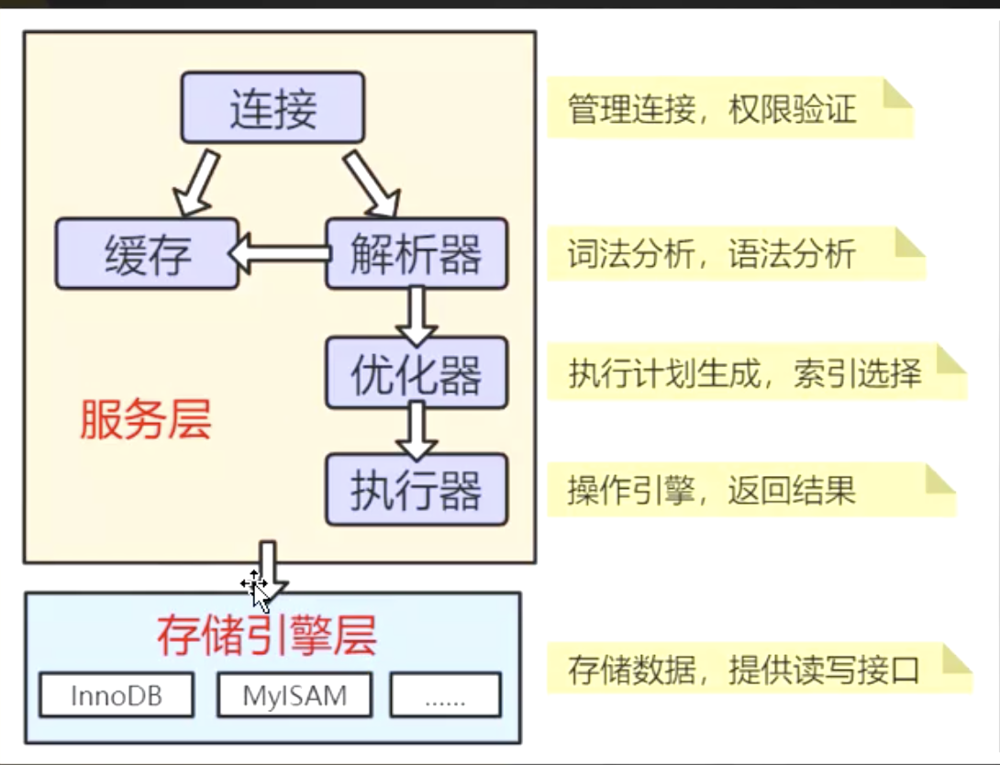

##### 连接

服务端线程数，一个会话，一个连接就是一个线程

###### mysql允许的最大连接数是？

max_connections. default 151. 最大10万个

##### 查询缓存

mysql缓存默认关闭

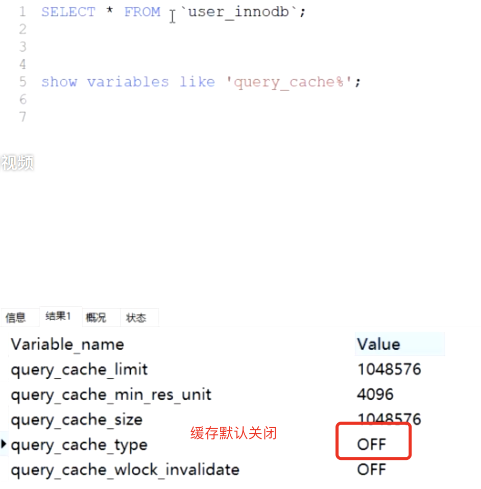

##### 解析器

词法分析&语法分析

解析树

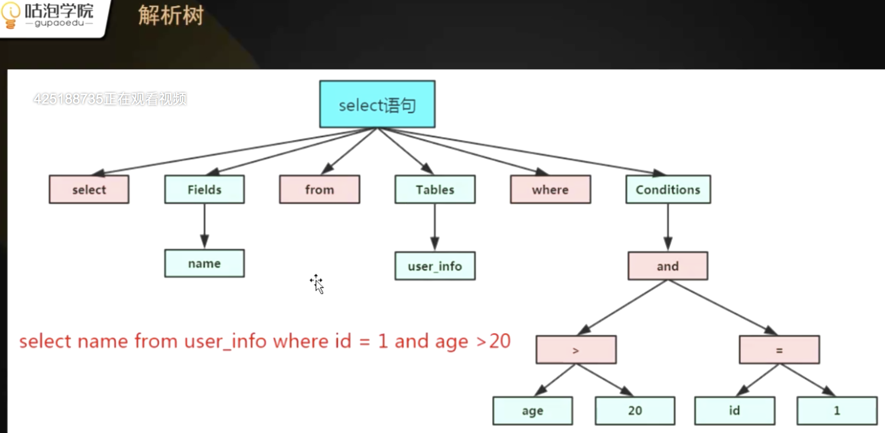

##### 预处理器

语义

##### 优化器

1.生成执行路径

2.选择最优执行路径

基于成本**const** 开销

a,b 多个索引

 

##### 执行计划

explain

##### 存储引擎

分析：存储引擎的数据都存储在磁盘中

表数据所在磁盘路径：show variables like  'matadir'

5.5之后 默认存储引擎 innodb

5.5之前 myISAM

Table1  快不要持久化 内存

Table2  历史数据 不用修改，不需要索引 压缩

Table3  读写并发，数据一致性

#### 如何update一条语句？

大体流程：先从磁盘加载数据到存储引擎，然后从存储引擎的内存在加载到server的内存去处理。

问题：磁盘相对于内存读取数据慢两个数量级，

而且要是几条数据，数据在磁盘的不同位置，需寻址，所以特别慢

INnodb：预读取的概念：一块一块拿，附件的数据也会拿

从磁盘加载数据到内存的固定的单位 叫 页Page ，默认4k

InnodB 的话，每页读取的 page _size 是16K (逻辑页 读数据)

那么有没有提升从磁盘加载到内存的优化？有，使用Buffer Pool

Buffer Pool：提升读写性能的关键。占服务器大小的百分之80（200G的内存mBuffer Pool占比百分之80）

分析：客户端读数据并不会直接读磁盘，而是先读区Buffer Pool有没有数据

​			客户端写数据并不会直接写进磁盘，而是先存入Buffer Pool

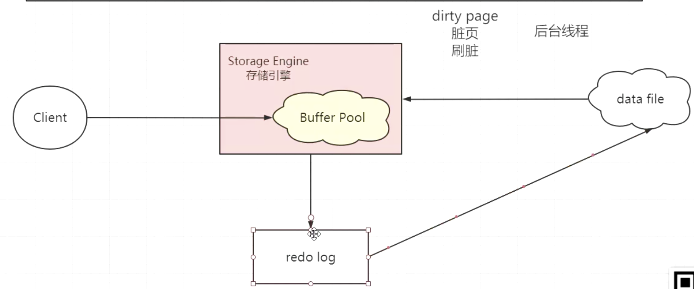

、

BufferPool 中的数据叫脏页，同步到磁盘，叫刷脏

后台线程刷脏速度超级快！！几乎感觉不到。

Redo log：BufferPool里的数据也会同步到redo log中

解决崩溃恢复的问题。万一内存里的信息丢失了，从log恢复到磁盘。ACID里的持久性就是靠Redo log来实现的

疑问：当存数据是，为什么不直接存到磁盘，而非要先存早redo log里？

随机 I/O page 16KB 16384bytes 寻址

顺序I/O ：在某些条件下，存取速度大于内存  连续append

将内存里的数据先写入redo log 在通过后台线程将数据写入磁盘，若中途断电，可通过redo log恢复

还有个好处是大大提高了吞吐量：将内存中的数据先写入log，可以给后台线程刷脏喘息的机会，从而大大提高了吞吐量。

Redo log只用来做崩溃恢复，不能做数据恢复。Redo log里面数据覆盖的很快。

特性：

1.记录数据页的改动，物理日志。

2.大小固定，前面的内容会覆盖

3.在INNoDB存储引擎实现

4.用于崩溃恢复

Undo log:撤销日志 回滚日志 -- 原子性

更新一条数据流程：

User name 青山penyuyan

 

@Tracsation;

1.磁盘disk --- 读取至buffer Pool --- 读取至server（数据的操作）

2. server层：page数据里的青山 改为penyuyan 

3.调用存储引擎的API --写入buffer Pool，什么时候刷脏，取决于线程

4. 记录undo log（回滚）/ redo log（崩溃恢复）--事务日志

5.事务提交

6.commit后才会刷脏，将pool里的数据写入磁盘

Bin log

含义：放在server中，默认关闭

DDL DML 逻辑日志（记录的是语句）

1.主从复制：slave请求master上的 bin log ，响应给slave,把sql语句在slave上重复一遍

2.数据恢复：因为不会出现数据覆盖

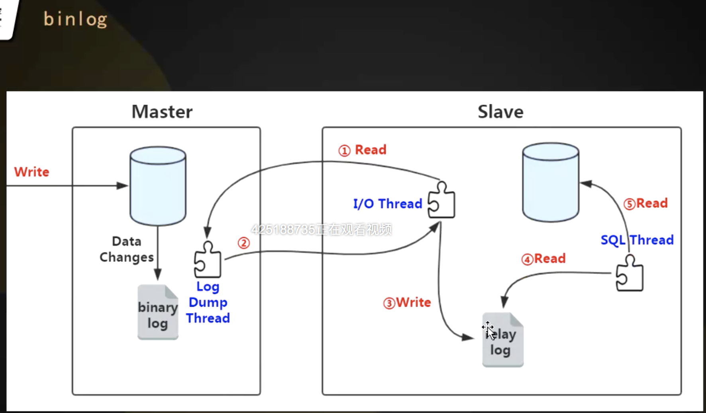

binlog特性：

1.记录DDL和DML的语句，属于逻辑日志

2.没有固定大小限制，内容可以追加

3.Server层实现，可以被所有存储引擎使用

4.用于数据恢复和主从复制

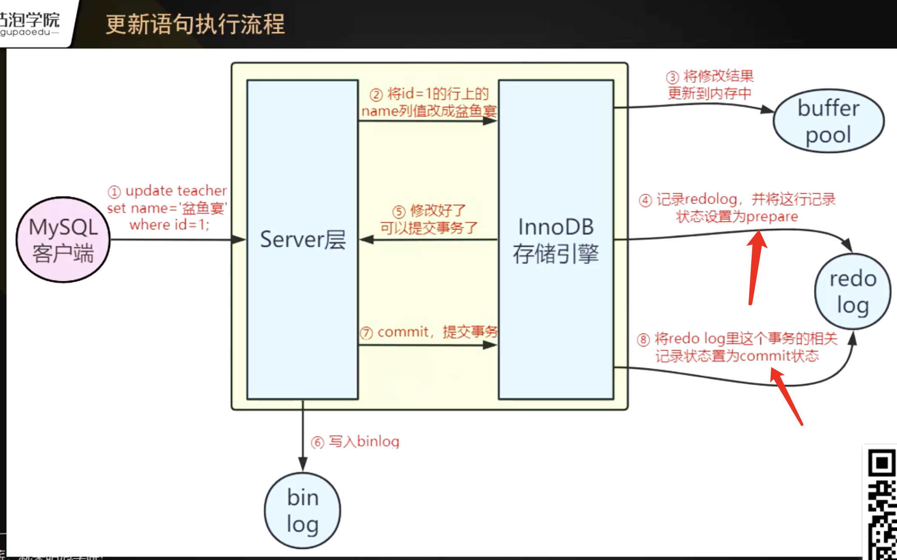

## My Sql索引

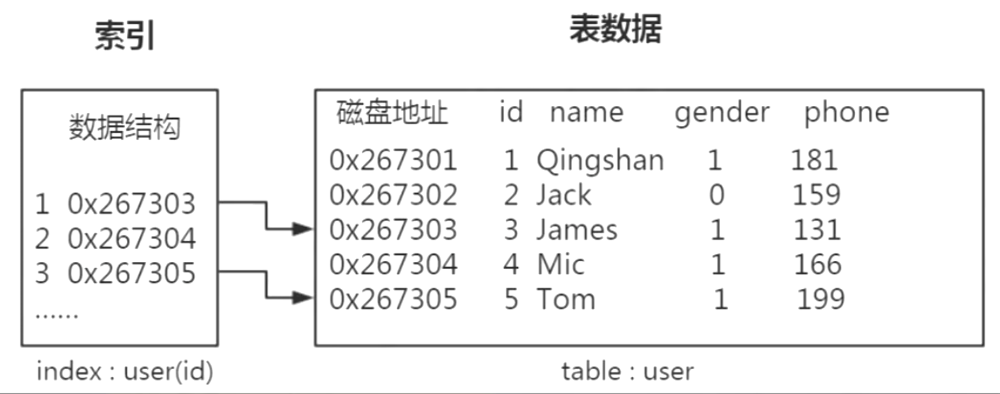

数据库索引，是一种排序的数据结构，以协助快速查询、更新数据库表中的数据。类似于书的目录。

### 索引类型

- 普通索引

- 唯一索引 unique 索引列不能重复

- 全文索引 FULL TEXT KEY

 

### 索引结构

#### 二叉查找树 Binary Search Tree

缺点：可能会变成单链表

#### AVL树 平衡二叉查找树

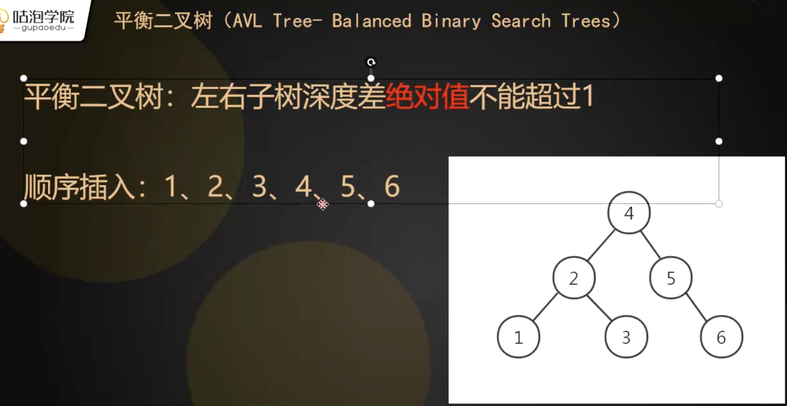

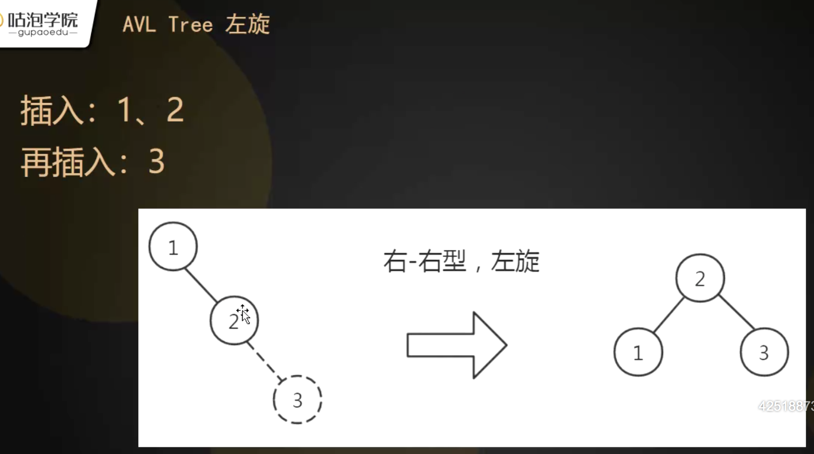

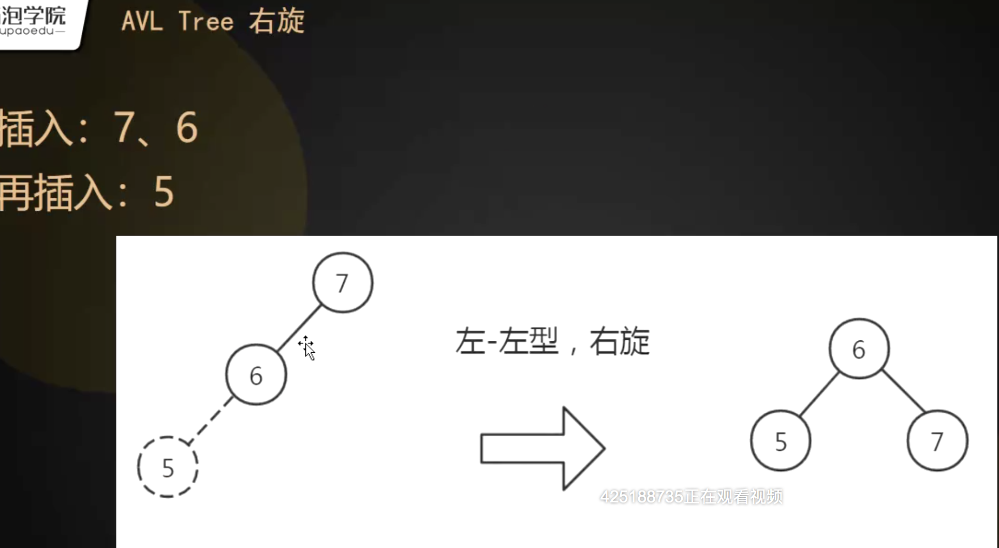

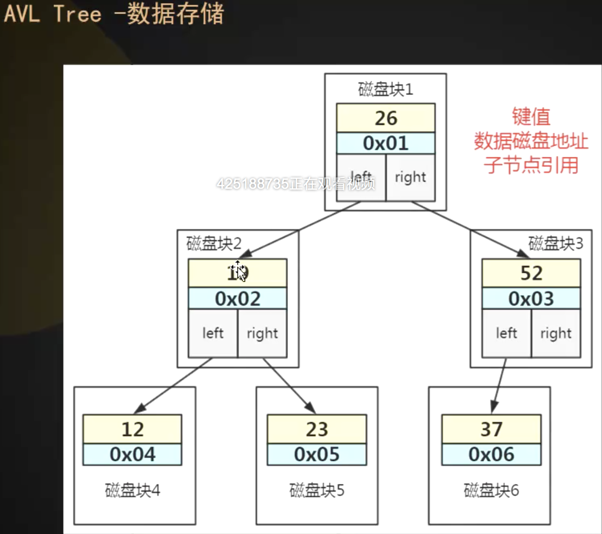

索引也是放在磁盘上！

Where id =23 ,会把第一个磁盘块的内容加载到内存，发现不在磁盘一上，走左边，发现磁盘二也不是，比较后走右边。

访问一个树的节点，就会发生一个磁盘的IO，而我们在INNOBD里面操作磁盘的最小单位是page,把磁盘加载到内存的默认大小是16KB,1638bytes.

而一个磁盘块才十几个bytes，远远达不到1638bytes.严重浪费空间。

弊端：访问一个磁盘块，就会仅从一次磁盘IO，寻址的操作，会导致树的深度特别深！若查找23，则会进行三次IO

#### 多路平衡查找树 B Tree

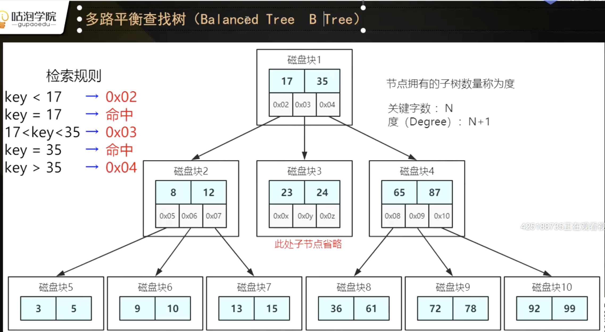

分裂&合并

树的分裂与合并，其实也就是存储引擎的页page的不断调整，自增主键和uuid byte不一样

为什么推荐使用递增的ID作为主键索引？而不是UUID、身份证？

避免多路平衡二叉树的每个page页存储的节点不断调整，会带来计算的开销

而一个id超过了16KB，则存储到溢出页。

特点：

一个磁盘存1000个key差不多达到16KB

那么B Tree三层结构就可以存储 1000*1000**1000 百万级别，那么三次磁盘IO就能找到，所以效率特别高！！

#### B+Tree

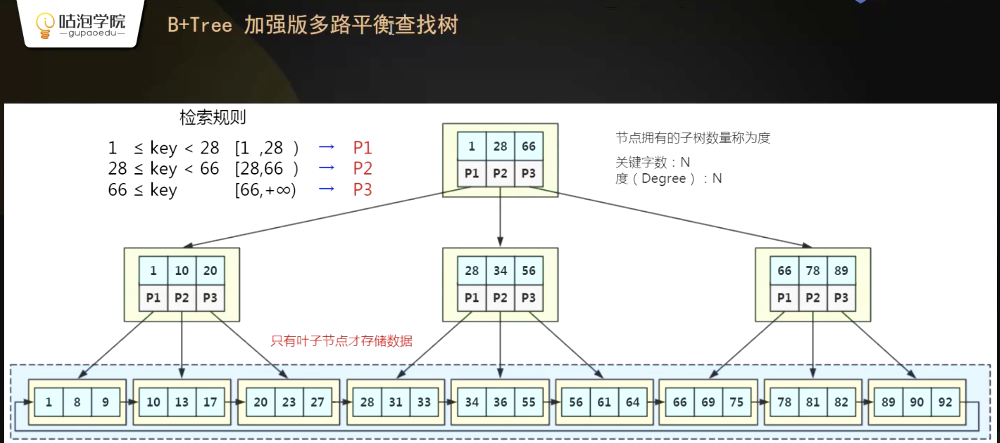

- 键值 度 1:1
- 数据只存放在叶子节点
- 叶子节点有指向前后节点的双向指针

核心：内节点只存 key和节点引用，没有存磁盘地址，所以内节点可以存更多的key，导致深度进一步降低

#### Hash索引

INNODB不能直接创建hash索引

- 无序 不能order by 
- 相同的hash码，哈希冲突

### 索引在不同存储引擎里的实现？

MyISAM 索引和数据是分开放的

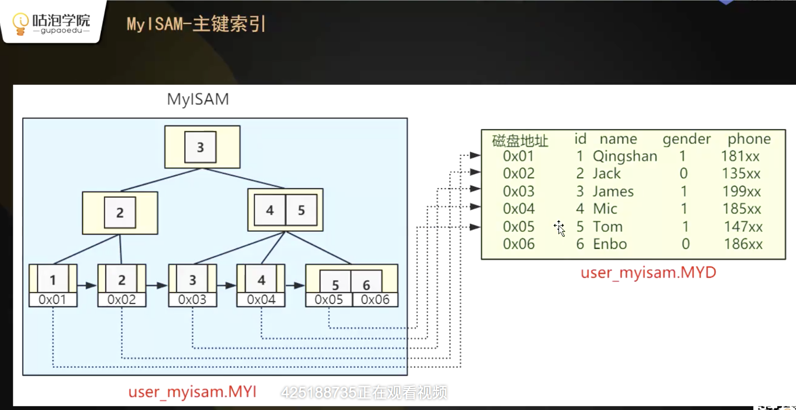

Innodb里有聚集索引的概念

聚集索引 cluster index

索引的键值的逻辑顺序与数据行的物理存储顺序是一致的

主键索引就是聚集索引，会决定物理行的顺序，所以不建议用uuid作为主键，不连续

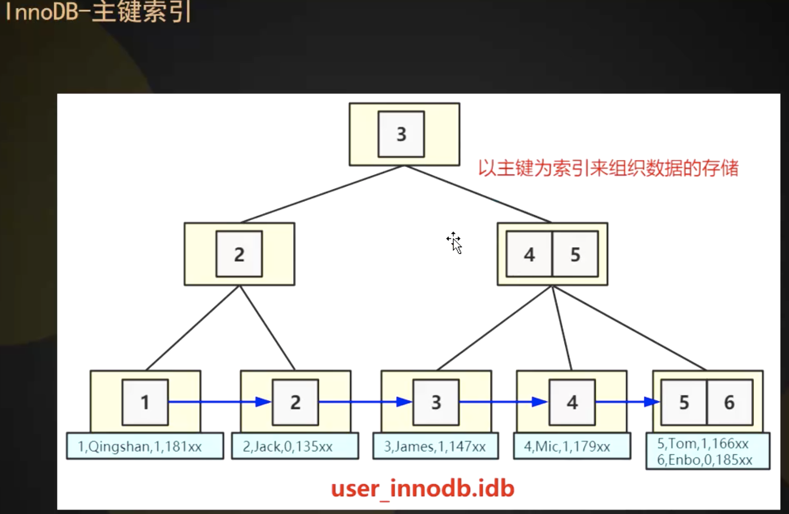

聚集索引

红线叫回表

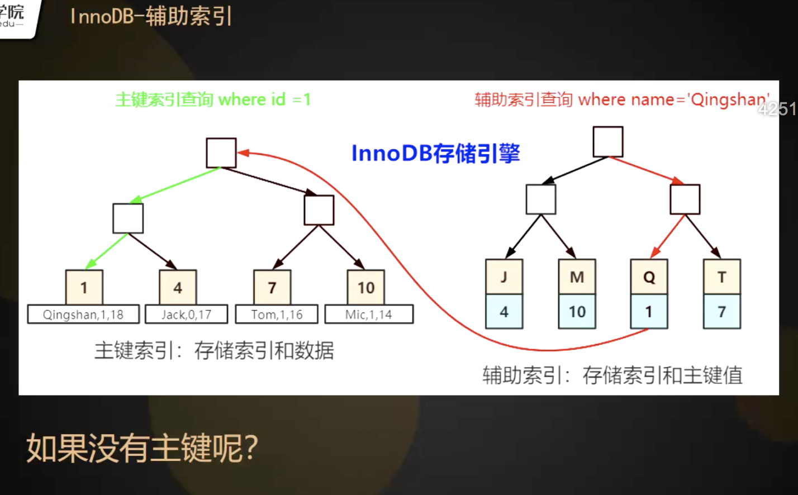

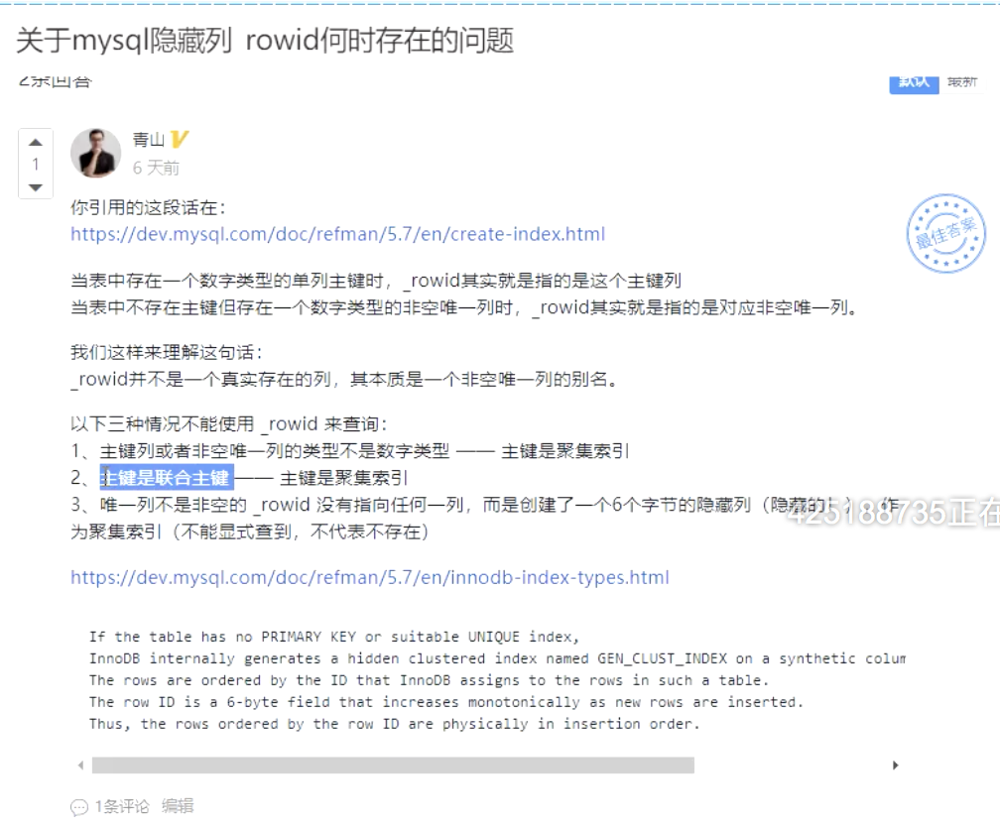

### 索引创建和使用原则？

列的离散度

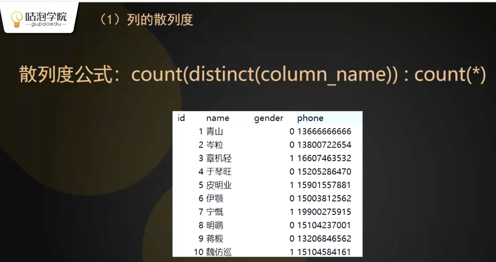

手机号的离散度更大，没有一个重复的

不要再离散度特别低的列建索引

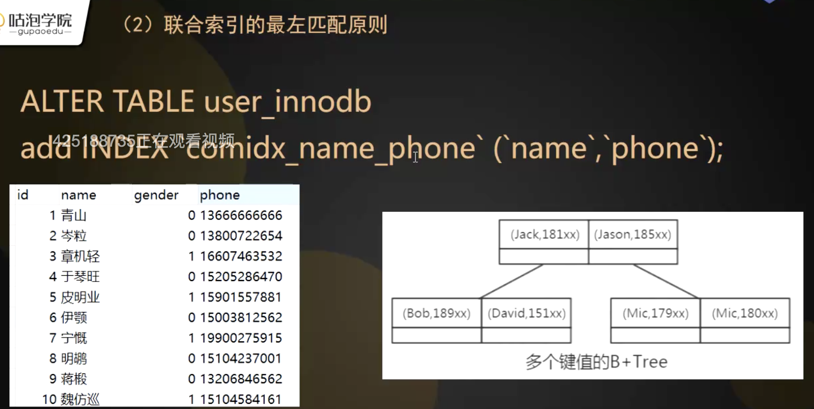

必须从索引的第一个字段开始，不能跳过

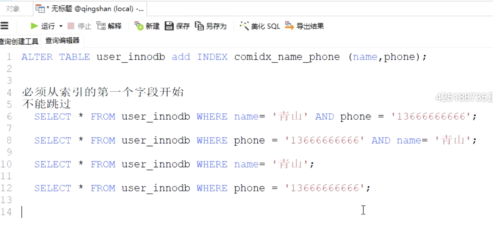

哪几个用到了索引

1 2 3 

第三个能用到索引，因为name索引是有序的

覆盖索引：在联合索引的基础上在进行索引

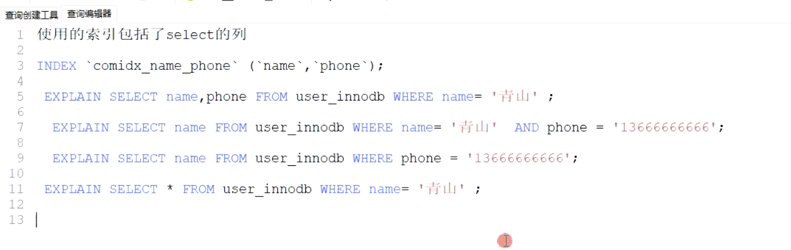

1 2 3能用到覆盖索引

## MySql事务和锁机制理解

#### 什么是事务？

Innodb支持事务

事务的四大特性 ACID

原子性用undo log来实现

持久性用redo log来实现 commit后一定能恢复

隔离性 ：事务相互隔离 互不干扰

一致性：

数据库自带的约束：更新前更新后主键不能重复

用户自定义的一致性：一个余额减少了1000 一个余额必须增加了1000

一致性需要原子性、持久性、隔离性来控制

事务自动开启？

#### 事务的并发问题

事务并发带来的：

脏读

、

脏读：一次事务前后两次读取数据发生了不一致的情况，是因为读取到了另一个事务未提交的数据

分析：未提交的数据在bufferPool里面，还未刷脏，所以读取到的是脏页里的数据

不可重复读：并发是前提！！！！！！！！！！！

一个事务前后两次读取的数据不一致，是因为读取到了另一个事务已提交的数据

幻读：

一个事务读取的数据多了一条，是因为读取了另一个事务已经提交的数据

只有新增引起的才叫幻读

问题：读数据但是却不允许别人修改，不好

MVCC解决读一致性

更新

旧版本数据放入undo log，用于回滚

MVCC ：非锁定的一致性读

意义：读写不冲突，效率高

总结：

隔离性怎么实现？

1.加锁

2.MVCC

场景：

order_info

order_detail

一对多

加表锁的前提：没有其他的任何事务已经锁定了这张表的任何一行数据

意向锁：一个标识

如果要给一条数据加上排它锁，那么必须得先加意向排它锁

如果要给一条数据加上共享锁，那么必须得先加意向共享锁

不使用索引：会锁表

上锁失败

主键索引-测试

主键索引+唯一索引 测试：

上锁失败

innodb到底靠什么加锁：靠索引，给索引上锁

1.为什么一张表没有索引会锁表？

所以：如果没有主键或者唯一索引，会对每行的id加锁，所以看起来就像是把表给锁住了

2.innodb存储引擎都是有索引的：

1.primary

2.not null unique key

3. row id

3.id有一个索引，name有一个索引，他们两个为什么要冲突？

 聚集索引和二级索引 回表

for update 排它锁一定要在索引字段上用，不然就会锁表。。

