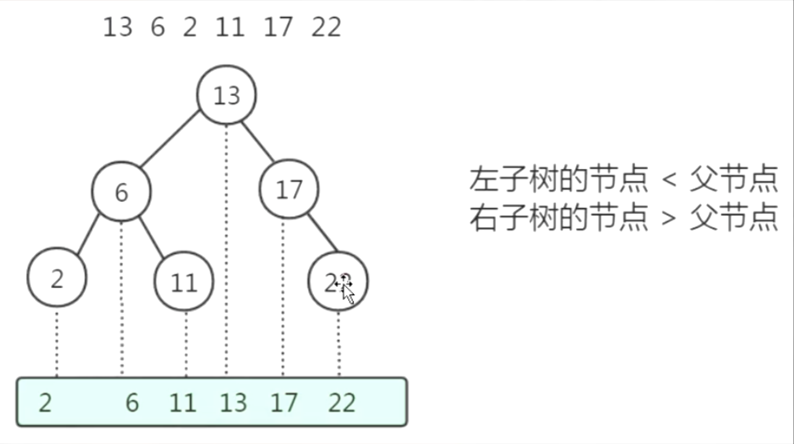

# MYSQL

## 1.描述一条语句的执行流程？


##### 连接

服务端线程数，一个会话，一个连接就是一个线程


###### mysql允许的最大连接数是？

max_connections. default 151. 最大10万个

##### 查询缓存

mysql缓存默认关闭


##### 解析器

词法分析&语法分析

解析树


##### 预处理器

语义

##### 优化器

1.生成执行路径

2.选择最优执行路径

基于成本**const** 开销

a,b 多个索引

 

##### 执行计划

explain


##### 存储引擎

分析：存储引擎的数据都存储在磁盘中

表数据所在磁盘路径：show variables like  'matadir'

5.5之后 默认存储引擎 innodb

5.5之前 myISAM

Table1  快不要持久化 内存

Table2  历史数据 不用修改，不需要索引 压缩

Table3  读写并发，数据一致性


#### 如何update一条语句？

大体流程：先从磁盘加载数据到存储引擎，然后从存储引擎的内存在加载到server的内存去处理。

问题：磁盘相对于内存读取数据慢两个数量级，

而且要是几条数据，数据在磁盘的不同位置，需寻址，所以特别慢

INnodb：预读取的概念：一块一块拿，附件的数据也会拿

从磁盘加载数据到内存的固定的单位 叫 页Page ，默认4k

InnodB 的话，每页读取的 page _size 是16K (逻辑页 读数据)


那么有没有提升从磁盘加载到内存的优化？有，使用Buffer Pool

Buffer Pool：提升读写性能的关键。占服务器大小的百分之80（200G的内存mBuffer Pool占比百分之80）

分析：客户端读数据并不会直接读磁盘，而是先读区Buffer Pool有没有数据

​			客户端写数据并不会直接写进磁盘，而是先存入Buffer Pool


、

BufferPool 中的数据叫脏页，同步到磁盘，叫刷脏

后台线程刷脏速度超级快！！几乎感觉不到。

Redo log：BufferPool里的数据也会同步到redo log中

解决崩溃恢复的问题。万一内存里的信息丢失了，从log恢复到磁盘。ACID里的持久性就是靠Redo log来实现的


疑问：当存数据是，为什么不直接存到磁盘，而非要先存早redo log里？

随机 I/O page 16KB 16384bytes 寻址

顺序I/O ：在某些条件下，存取速度大于内存  连续append


将内存里的数据先写入redo log 在通过后台线程将数据写入磁盘，若中途断电，可通过redo log恢复

还有个好处是大大提高了吞吐量：将内存中的数据先写入log，可以给后台线程刷脏喘息的机会，从而大大提高了吞吐量。


Redo log只用来做崩溃恢复，不能做数据恢复。Redo log里面数据覆盖的很快。

特性：

1.记录数据页的改动，物理日志。

2.大小固定，前面的内容会覆盖

3.在INNoDB存储引擎实现

4.用于崩溃恢复

Undo log:撤销日志 回滚日志 -- 原子性


更新一条数据流程：

User name 青山penyuyan

 

@Tracsation;

1.磁盘disk --- 读取至buffer Pool --- 读取至server（数据的操作）

2. server层：page数据里的青山 改为penyuyan 

3.调用存储引擎的API --写入buffer Pool，什么时候刷脏，取决于线程

4. 记录undo log（回滚）/ redo log（崩溃恢复）--事务日志

5.事务提交

6.commit后才会刷脏，将pool里的数据写入磁盘


Bin log

含义：放在server中，默认关闭

DDL DML 逻辑日志（记录的是语句）

1.主从复制：slave请求master上的 bin log ，响应给slave,把sql语句在slave上重复一遍

2.数据恢复：因为不会出现数据覆盖


binlog特性：

1.记录DDL和DML的语句，属于逻辑日志

2.没有固定大小限制，内容可以追加

3.Server层实现，可以被所有存储引擎使用

4.用于数据恢复和主从复制


## 2.My Sql索引


数据库索引，是一种排序的数据结构，以协助快速查询、更新数据库表中的数据。类似于书的目录。

### 索引类型

**Normal:**

表示普通索引，大多数情况下都可以使用

**Unique:**

约束唯一标识数据库表中的每一条记录，即在单表中不能用每条记录是唯一的（例如身份证就是唯一的），Unique(要求列唯一)和Primary Key(primary key = unique + not null 列唯一)约束均为列或列集合中提供了唯一性的保证，Primary Key是拥有自动定义的Unique约束，但是每个表中可以有多个Unique约束，但是只能有一个Primary Key约束。

mysql中创建Unique约束

**Full Text**:

表示全文收索，在检索长文本的时候，效果最好，短文本建议使用Index,但是在检索的时候数据量比较大的时候，现将数据放入一个没有全局索引的表中，然后在用Create Index创建的Full Text索引，要比先为一张表建立Full Text然后在写入数据要快的很多

总结，索引的类别由建立索引的字段内容特性来决定，通常normal最常见.


### 索引合并


为什么出现索引合并？

- **intersect 交集**
- **union 并集**


**where 条件后可能有多个条件（或者 join ）涉及到多个字段，他们之间进行 AND 或 OR，那么此时就有可能会用到 index_merge 技术； index_merge 技术如果简单的说就是：对多个索引分别进行条件扫描，然后将各自的结果进行合并（intersect/union）**

**MySQL 5.0 之前，一个表只能使用一个索引，无法同时使用多个索引分别进行条件扫描，在 MySQL 5.1 开始，引入了 index_merge 优化技术，对同一个表可以使用多个索引分别进行条件扫描**


### 索引合并和联合索引的区别


你有索引index1（baia,b,c)，这是是联合索引，也叫复合索引、多列索引；

你有索引index2（a），index3（b），index4（c），然后你dao的sql中有and、or或union之类的条件对三个索引分别进行条件扫描，然后将各自的结果进行合并，这叫索引合并，这时你用explain查看执行计划会看到有“index merge”字样。

至于两者有没有关系，这怎么讲呢，一般来说，联合索引（复合索引）的效率要比索引合并要高，在能使用联合索引时尽量使用联合索引，当然这要根据具体情况，sql中寸在“or”这样的连接词时，那就可能必须要使用索引合并了。


### 

### 索引结构

#### 二叉查找树 Binary Search Tree



缺点：可能会变成单链表


#### AVL树 平衡二叉查找树


索引也是放在磁盘上！

Where id =23 ,会把第一个磁盘块的内容加载到内存，发现不在磁盘一上，走左边，发现磁盘二也不是，比较后走右边。

访问一个树的节点，就会发生一个磁盘的IO，而我们在INNOBD里面操作磁盘的最小单位是page,把磁盘加载到内存的默认大小是16KB,1638bytes.

而一个磁盘块才十几个bytes，远远达不到1638bytes.严重浪费空间。

弊端：访问一个磁盘块，就会仅从一次磁盘IO，寻址的操作，会导致树的深度特别深！若查找23，则会进行三次IO

#### 多路平衡查找树 B Tree


分裂&合并

树的分裂与合并，其实也就是存储引擎的页page的不断调整，自增主键和uuid byte不一样

为什么推荐使用递增的ID作为主键索引？而不是UUID、身份证？

避免多路平衡二叉树的每个page页存储的节点不断调整，会带来计算的开销

而一个id超过了16KB，则存储到溢出页。


特点：

一个磁盘存1000个key差不多达到16KB

那么B Tree三层结构就可以存储 1000*1000**1000 百万级别，那么三次磁盘IO就能找到，所以效率特别高！！


#### B+Tree


- 键值 度 1:1
- 数据只存放在叶子节点
- 叶子节点有指向前后节点的双向指针

核心：内节点只存 key和节点引用，没有存磁盘地址，所以内节点可以存更多的key，导致深度进一步降低


#### Hash索引

INNODB不能直接创建hash索引

- 无序 不能order by 
- 相同的hash码，哈希冲突


### 索引在不同存储引擎里的实现？

MyISAM 索引和数据是分开放的


Innodb里有聚集索引的概念

聚集索引 cluster index

索引的键值的逻辑顺序与数据行的物理存储顺序是一致的

主键索引就是聚集索引，会决定物理行的顺序，所以不建议用uuid作为主键，不连续


聚集索引

红线叫回表


### 索引创建和使用原则？

列的离散度


手机号的离散度更大，没有一个重复的

不要再离散度特别低的列建索引


必须从索引的第一个字段开始，不能跳过


哪几个用到了索引

1 2 3 

第三个能用到索引，因为name索引是有序的


覆盖索引：在联合索引的基础上在进行索引


1 2 3能用到覆盖索引


#### 在什么字段上创建索引？


为了使索引的使用效率更高，在创建索引时，必须考虑在哪些字段上创建索引和创建什么类型的索引,有7大原则：

**1．选择唯一性索引**

唯一性索引的值是唯一的，可以更快速的通过该索引来确定某条记录。例如，学生表中学号是具有唯一性的字段。为该字段建立唯一性索引可以很快的确定某个学生的信息。如果使用姓名的话，可能存在同名现象，从而降低查询速度。

**2．为经常需要排序、分组和联合操作的字段建立索引**

经常需要ORDER BY、GROUP BY、DISTINCT和UNION等操作的字段，排序操作会浪费很多时间。如果为其建立索引，可以有效地避免排序操作。

**3．为常作为查询条件的字段建立索引**

如果某个字段经常用来做查询条件，那么该字段的查询速度会影响整个表的查询速度。因此，为这样的字段建立索引，可以提高整个表的查询速度。

**4．限制索引的数目**

索引的数目不是越多越好。每个索引都需要占用磁盘空间，索引越多，需要的磁盘空间就越大。修改表时，对索引的重构和更新很麻烦。越多的索引，会使更新表变得很浪费时间。

**5．尽量使用数据量少的索引**

如果索引的值很长，那么查询的速度会受到影响。例如，对一个CHAR（100）类型的字段进行全文检索需要的时间肯定要比对CHAR（10）类型的字段需要的时间要多。

**6．尽量使用前缀来索引**

如果索引字段的值很长，最好使用值的前缀来索引。例如，TEXT和BLOG类型的字段，进行全文检索会很浪费时间。如果只检索字段的前面的若干个字符，这样可以提高检索速度。

**7．删除不再使用或者很少使用的索引**

表中的数据被大量更新，或者数据的使用方式被改变后，原有的一些索引可能不再需要。数据库管理员应当定期找出这些索引，将它们删除，从而减少索引对更新操作的影响。

注意：选择索引的最终目的是为了使查询的速度变快。上面给出的原则是最基本的准则，但不能拘泥于上面的准则。读者要在以后的学习和工作中进行不断的实践。根据应用的实际情况进行分析和判断，选择最合适的索引方式。


#### 什么时候索引失效？


## 3.MySql事务和锁机制理解

#### 什么是事务？

Innodb支持事务

事务的四大特性 ACID


原子性用undo log来实现

持久性用redo log来实现 commit后一定能恢复

隔离性 ：事务相互隔离 互不干扰


一致性：

数据库自带的约束：更新前更新后主键不能重复

用户自定义的一致性：一个余额减少了1000 一个余额必须增加了1000


一致性需要原子性、持久性、隔离性来控制


事务自动开启？


#### 事务的并发问题

事务并发带来的：

脏读

、


脏读：一次事务前后两次读取数据发生了不一致的情况，是因为读取到了另一个事务未提交的数据

分析：未提交的数据在bufferPool里面，还未刷脏，所以读取到的是脏页里的数据


不可重复读：并发是前提！！！！！！！！！！！

一个事务前后两次读取的数据不一致，是因为读取到了另一个事务已提交的数据


幻读：

一个事务读取的数据多了一条，是因为读取了另一个事务已经提交的数据


只有新增引起的才叫幻读


问题：读数据但是却不允许别人修改，不好


MVCC解决读一致性


更新


旧版本数据放入undo log，用于回滚


MVCC ：非锁定的一致性读

意义：读写不冲突，效率高


总结：

隔离性怎么实现？

1.加锁

2.MVCC


场景：

order_info

order_detail

一对多


加表锁的前提：没有其他的任何事务已经锁定了这张表的任何一行数据

意向锁：一个标识

如果要给一条数据加上排它锁，那么必须得先加意向排它锁

如果要给一条数据加上共享锁，那么必须得先加意向共享锁


不使用索引：会锁表


上锁失败


主键索引-测试


主键索引+唯一索引 测试：


上锁失败

innodb到底靠什么加锁：靠索引，给索引上锁


1.为什么一张表没有索引会锁表？

所以：如果没有主键或者唯一索引，会对每行的id加锁，所以看起来就像是把表给锁住了

2.innodb存储引擎都是有索引的：

1.primary

2.not null unique key

3. row id


3.id有一个索引，name有一个索引，他们两个为什么要冲突？

 聚集索引和二级索引 回表


for update 排它锁一定要在索引字段上用，不然就会锁表。。


## 疑问

#### 1.MySQL数据库查询记录时是否每次只能使用一个索引？


在网上看一些文章的时候，发现好几次下面这样的话：

如果经常需要同时对两个字段进行AND查询,那么**使用两个单独索引不如建立一个复合索引，因为两个单独索引通常数据库只能使用其中一个**，而使用复合索引因为索引本身就对应到两个字段上的，效率会有很大提高。


起因：

以下是一个不完整的课程表，我只把我需要的字段保留下来了，创建了两个单独的索引 `idx_city_id` 和`idx_start_course_time`


```sql
CREATE TABLE `t_lesson` (
    `id` BIGINT(20) NOT NULL AUTO_INCREMENT,
    `start_course_time` DATETIME NOT NULL COMMENT '预计直播课上课时间',
    `end_course_time` DATETIME NOT NULL COMMENT '预计直播课下课时间',
    `city_id` INT(11) NOT NULL,
    PRIMARY KEY (`id`),
    INDEX `idx_city_id` (`city_id`),
    INDEX `idx_start_course_time` (`start_course_time`),
);
```

执行以下语句：

```sql
explain select * from t_lesson where start_course_time = '2019-08-25 06:00:00' and city_id=4;
```

key 代表 MySQL 实际会使用的索引，是`idx_start_course_time`


当时脑子出现了以下几个问题：

- MySQL 同时只能使用一个索引吗？

- 什么情况下能使用两个索引呢？

- 为什么存在两个索引的情况下却只使用了一个索引呢？

  

解决问题：

**MySQL 同时只能使用一个索引吗？**

网上随处可见，MySQL5.0之后是有索引合并这个概念的，所以第一个问题解决了，MySQL可以同时使用多个索引


只能使用1个，所以要合理的使用组合索引，而不是单列索引。

那么如何合理规划组合索引？这里教你一个简单的原则，例如


```sql
select count(1) from table1 where column1 = 1 and column2 = 'foo' and column3 = 'bar'
```


上例中，我们看到 where 了 3 个字段，那么请为这 3 个字段建立组合索引，同理，这也适用于 order by 或 group by 字段。


**什么情况下能使用两个索引呢？**


以下只做个例子，具体情况可以具体看下索引合并文档


```sql
explain select * from t_lesson where start_course_time = '2019-08-25 06:00:00' or city_id=4;
```


**为什么存在两个索引的情况下却只使用了一个索引呢？**


与其说是“数据库查询只能用到一个索引”，倒不是说是 和全表扫描/只使用一个索引的速度比起来，去分析两个索引二叉树更加耗费时间，所以绝大多数情况下数据库都是是用一个索引。
如这条语句：

```sql
select count(1) from table1 where column1 = 1 and column2 = 'foo' and column3 = 'bar'
```

我们来想象一下当数据库有N个索引并且查询中分别都要用上他们的情况：
查询优化器（用大白话说就是生成执行计划的那个东西）需要进行N次主二叉树查找[这里主二叉树的意思是最外层的索引节点]，此处的查找流程大概如下：
查出第一条column1主二叉树等于1的值，然后去第二条column2主二叉树查出foo的值并且当前行的coumn1必须等于1，最后去column主二叉树查找bar的值并且column1必须等于1和column2必须等于foo。
如果这样的流程被查询优化器执行一遍，就算不死也半条命了，查询优化器可等不及把以上计划都执行一遍，贪婪算法（最近邻居算法）可不允许这种情况的发生，所以当遇到以下语句的时候，数据库只要用到第一个筛选列的索引（column1），就会直接去进行表扫描了。

select count(1) from table1 where column1 = 1 and column2 = 'foo' and column3 = 'bar'

所以与其说是数据库只支持一条查询语句只使用一个索引，倒不如说N条独立索引同时在一条语句使用的消耗比只使用一个索引还要慢。
所以如上条的情况，最佳推荐是使用index(column1,column2,column3） 这种联合索引，此联合索引可以把b+tree结构的优势发挥得淋漓尽致：
一条主二叉树（column=1），查询到column=1节点后基于当前节点进行二级二叉树column2=foo的查询，在二级二叉树查询到column2=foo后，去三级二叉树column3=bar查找。


#### 2.in 会不会走索引？

https://tech.meituan.com/2014/06/30/mysql-index.html 

https://blog.csdn.net/LJFPHP/article/details/89156326


## 4.MySql语法


#### 4.1.MySQL中MAX函数与Group By一起使用的注意事项


如果想找到每个class里面的最大的age，则需要使用group by和max。

如下的sql语句，则输出结果有错误：


虽然找到的age是最大的age，但是与之匹配的用户信息却不是真实的信息，而是group by分组后的第一条记录的基本信息。


方法一：

如果我使用以下的语句进行查找，则可以返回真实的结果。


思路：1.先根据条件将取最大值的字段 降序

​			2.然后group by分组，那么分组后的第一笔数据就是最大的值

方法二：

**select** * **from** test t where t.age = (**select** max(age) **from** test **where t.class = class**) **order** **by** class; 

#### 4.2 group by用法解析

##### 1.group by的常规用法

group by的常规用法是配合聚合函数，利用分组信息进行统计，常见的是配合max等聚合函数筛选数据后分析，以及配合having进行筛选后过滤。

数据：


- 聚合函数max

select max(user_id),grade from user_info group by grade ;

结果：


这条sql的含义很明确，将数据按照grade字段分组，查询每组最大的user_id以及当前组内容。注意，这里分组条件是grade，查询的非聚合条件也是grade。这里不产生冲突。

having用法：

select max(user_id),grade from user_info group by grade having grade>'A'


这条sql与上面例子中的基本相同，不过后面跟了having过滤条件。将grade不满足’>A’的过滤掉了。注意，这里分组条件是grade，查询的非聚合条件也是grade。这里不产生冲突。

##### 2.group by的非常规用法

select max(user_id),id,grade from user_info group by grade


这条sql的结果就值得讨论了，与上述例子不同的是，查询条件多了id一列。数据按照grade分组后，grade一列是相同的，max(user_id)按照数据进行计算也是唯一的，id一列是如何取值的？看上述的数据结果，
推论：id是物理内存的第一个匹配项。
究竟是与不是需要继续探讨。

##### 结论：

- 当group by 与聚合函数配合使用时，功能为分组后计算
- 当group by 与having配合使用时，功能为分组后过滤
- 当group by 与聚合函数，同时非聚合字段同时使用时，非聚合字段的取值是第一个匹配到的字段内容，即id小的条目对应的字段内容。

#### 4.3 数据库查询数据的第一条

-  sqlserver

```mysql
select top 1* from user where name='张三'
```

在查询的过程中，这里的1表示是取出数据库中的符合条件的第一条数据，如果改成2，则表示前两条，但是后面的*不能漏掉。

- oracle

```mysql
SELECT
	* 
FROM
	(
	SELECT
		t.* 
	FROM
		"ECP_ANC_TYPE" t
		LEFT JOIN "ECP_ANC_TYPE_RANGE" r ON r.ANC_TYPE_OID = t.OID 
	WHERE
		r.ANC_TYPE_OID IS NULL 
	ORDER BY
		TYPE_ID ASC 
	) b 
WHERE
	ROWNUM =1
```

思路：先根据条件降序，然后在设置条件ROWNUM = 1

注意：

```mysql
SELECT
		t.* 
	FROM
		"ECP_ANC_TYPE" t
		LEFT JOIN "ECP_ANC_TYPE_RANGE" r ON r.ANC_TYPE_OID = t.OID 
	WHERE
		r.ANC_TYPE_OID IS NULL AND  ROWNUM =1
```

该写法为错误写法，需注意

- mysql

  limit 1

#### 4.4 截取特定字符串之前或之后的字段

**substring_index(str,delim,count)**

**str:要处理的字符串**

**delim:分隔符**

**count:计数**

例子：str=[www.wikibt.com](http://www.wikibt.com/)

   substring_index(str,'.',1)

   结果是：www

   substring_index(str,'.',2)

   结果是：www.wikibt

   也就是说，如果count是正数，那么就是从左往右数，第N个分隔符的左边的全部内容

   相反，如果是负数，那么就是从右边开始数，第N个分隔符右边的所有内容，如：

   substring_index(str,'.',-2)

   结果为：wikibt.com

   有人会问，如果我要中间的的wikibt怎么办？

   很简单的，两个方向：

   从右数第二个分隔符的右边全部，再从左数的第一个分隔符的左边：

　substring_index(substring_index(str,'.',-2),'.',1);