---

---

# SpringCLoud

## 1.Eureka

为了解决微服务架构中的**服务实例维护问题(ip地址)**， 产生了大量的**服务治理**框架和产品。

在SpringCloud中我们的服务治理框架一般使用的就是Eureka。

- 服务提供者

- - **服务注册：**启动的时候会通过发送REST请求的方式将**自己注册到Eureka Server上**，同时带上了自身服务的一些元数据信息。
  - **服务续约：**在注册完服务之后，**服务提供者会维护一个心跳**用来持续告诉Eureka Server:  "我还活着 ” 、
  - **服务下线：**当服务实例进行正常的关闭操作时，它会**触发一个服务下线的REST请求**给Eureka Server, 告诉服务注册中心：“我要下线了 ”。

- 服务消费者

- - **获取服务：**当我们**启动服务消费者**的时候，它会发送一个REST请求给服务注册中心，来获取上面注册的服务清单
  - **服务调用：**服务消费者在获取服务清单后，通过**服务名**可以获得具体提供服务的实例名和该实例的元数据信息。在进行服务调用的时候，**优先访问同处一个Zone中的服务提供方**。

- Eureka Server(服务注册中心)：

- - **失效剔除：**默认每隔一段时间（默认为60秒） 将当前清单中超时（默认为90秒）**没有续约的服务剔除出去**。
  - **自我保护：**。EurekaServer 在运行期间，会统计心跳失败的比例在15分钟之内是否低于85%(通常由于网络不稳定导致)。Eureka Server会将当前的**实例注册信息保护起来**， 让这些实例不会过期，尽可能**保护这些注册信息**。

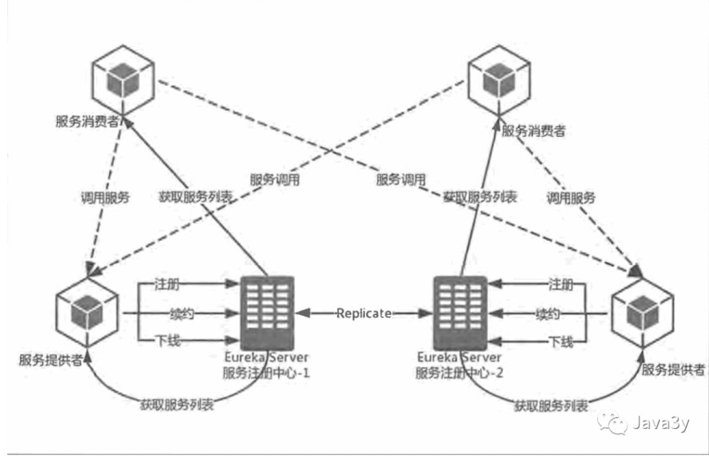

## 2.Ribbon

为了实现服务的**高可用**，我们可以将**服务提供者集群**。比如说，现在一个秒杀系统设计出来了，准备上线了。在11月11号时为了能够支持高并发，我们开多台机器来支持并发量。

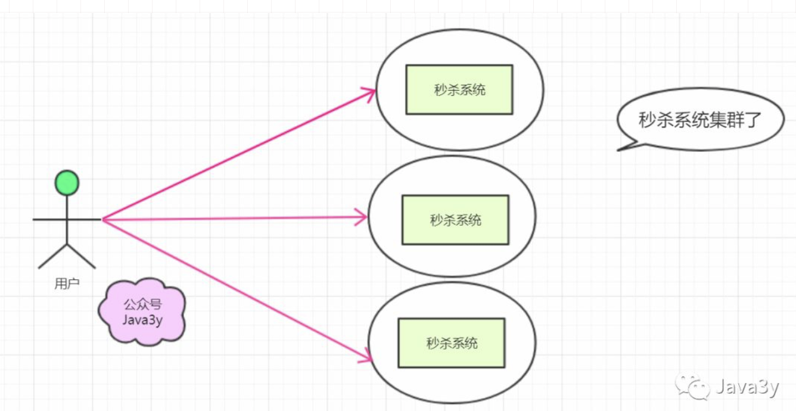

现在想要这三个秒杀系统**合理摊分**用户的请求(专业来说就是负载均衡)，可能你会想到nginx。

其实SpringCloud也支持的负载均衡功能，只不过它是**客户端的负载均衡**，这个功能实现就是Ribbon！

负载均衡又区分了两种类型：

- 客户端负载均衡(Ribbon)

- - 服务实例的**清单在客户端**，客户端进行负载均衡算法分配。
  - (从上面的知识我们已经知道了：客户端可以从Eureka Server中得到一份服务清单，在发送请求时通过负载均衡算法，**在多个服务器之间选择一个进行访问**)

- 服务端负载均衡(Nginx)

- - 服务实例的**清单在服务端**，服务器进行负载均衡算法分配

    

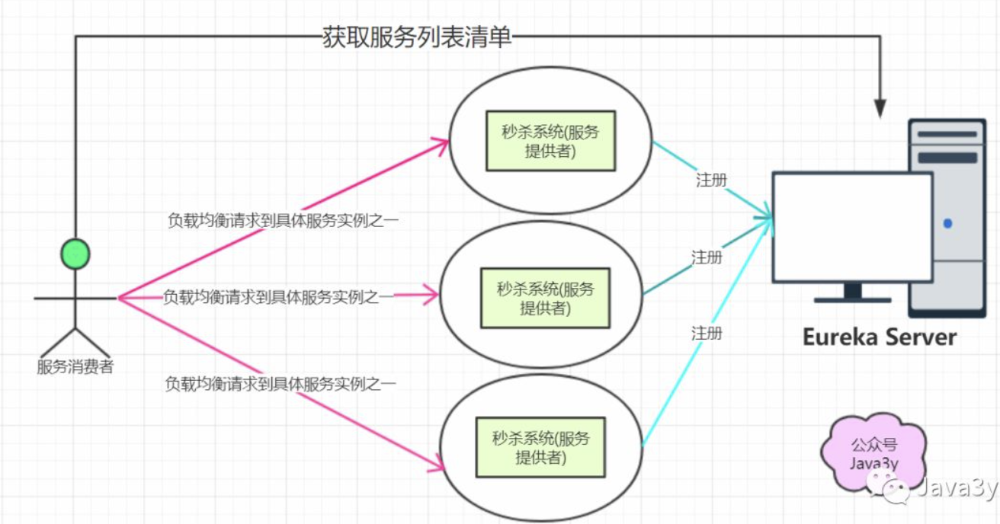

Ribbon是支持负载均衡，默认的负载均衡策略是轮询，我们也是可以根据自己实际的需求自定义负载均衡策略的。

## 3.Hystrix

在**高并发**的情况下，由于单个服务的延迟，可能导致**所有的请求都处于延迟状态**，甚至在几秒钟就使服务处于负载饱和的状态，资源耗尽，直到不可用，最终导致这个分布式系统都不可用，这就是“雪崩”。

针对上述问题， Spring Cloud Hystrix实现了**断路器、线程隔离**等一系列服务保护功能。

- Fallback(失败快速返回)：当某个服务单元发生故障（类似用电器发生短路）之后，通过断路器的故障监控（类似熔断保险丝）， **向调用方返回一个错误响应， 而不是长时间的等待**。这样就不会使得线程因调用故障服务被长时间占用不释放，**避免**了故障在分布式系统中的**蔓延**。
- 资源/依赖隔离(线程池隔离)：它会为**每一个依赖服务创建一个独立的线程池**，这样就算某个依赖服务出现延迟过高的情况，也只是对该依赖服务的调用产生影响， 而**不会拖慢其他的依赖服务**。

Hystrix提供几个熔断关键参数：`滑动窗口大小（20）、 熔断器开关间隔（5s）、错误率（50%）`

- 每当20个请求中，有50%失败时，熔断器就会打开，此时再调用此服务，将会**直接返回失败**，不再调远程服务。
- 直到5s钟之后，重新检测该触发条件，**判断是否把熔断器关闭，或者继续打开**。

Hystrix还有请求合并、请求缓存这样强大的功能，在此我就不具体说明了，有兴趣的同学可继续深入学习~

## 4.Feign

上面已经介绍了Ribbon和Hystrix了，可以发现的是：他俩作为基础工具类框架**广泛地应用**在各个微服务的实现中。我们会发现对这两个框架的**使用几乎是同时出现**的。

为了**简化**我们的开发，Spring Cloud Feign出现了！它基于 Netflix Feign 实现，**整合**了 Spring Cloud Ribbon 与 Spring Cloud Hystrix,  除了整合这两者的强大功能之外，它还提
供了**声明式的服务调用**(不再通过RestTemplate)。

Feign是一种声明式、模板化的HTTP客户端。在Spring Cloud中使用Feign, 我们可以做到使用HTTP请求远程服务时能与调用本地方法一样的编码体验，开发者完全感知不到这是远程方法，更感知不到这是个HTTP请求。

下面就简单看看Feign是怎么优雅地实现远程调用的：

服务绑定：

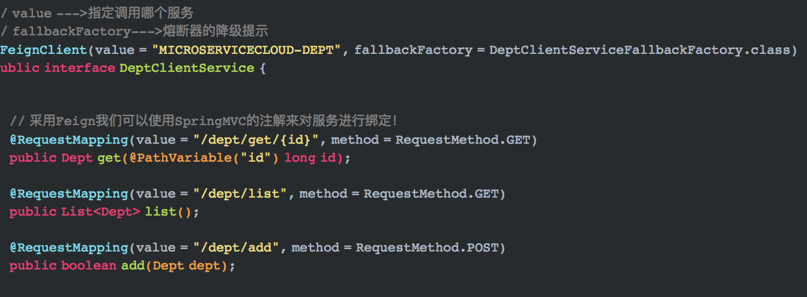

Feign中使用熔断器：

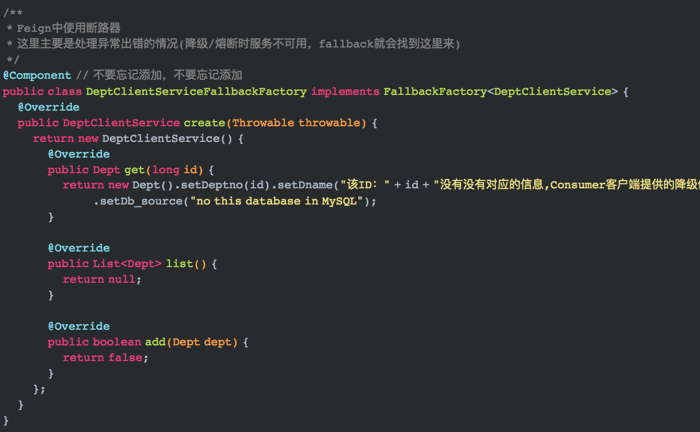

## 5.Zuul

基于上面的学习，我们现在的架构很可能会设计成这样：

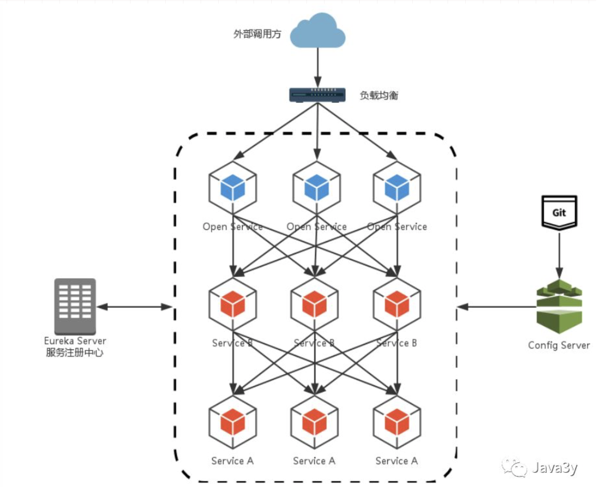

1. **路由规则与服务实例的维护间题**：外层的负载均衡(nginx)需要**维护**所有的服务实例清单(图上的OpenService)

2. **签名校验、 登录校验冗余问题**：为了保证对外服务的安全性， 我们在服务端实现的微服务接口，往往都会有一定的**权限校验机制**，但我们的服务是独立的，我们**不得不在这些应用中都实现这样一套校验逻辑**，这就会造成校验逻辑的冗余。

   

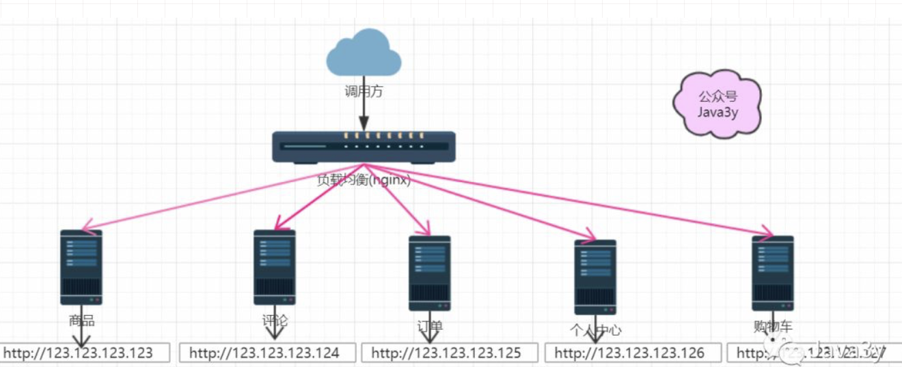

每个服务都有自己的IP地址，Nginx想要正确请求转发到服务上，就必须**维护着每个服务实例的地址**！

- 更是灾难的是：这些服务实例的IP地址还有可能会变，服务之间的划分也很可能会变。
- 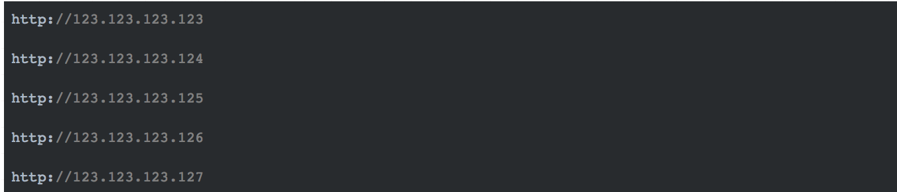

购物车和订单模块都需要用户登录了才可以正常访问，基于现在的架构，只能在**购物车和订单模块都编写校验逻辑**，这无疑是冗余的代码。

为了解决上面这些常见的架构问题，**API网关**的概念应运而生。在SpringCloud中了提供了基于Netfl ix Zuul实现的API网关组件**Spring Cloud Zuul**。

购物车和订单模块都需要用户登录了才可以正常访问，基于现在的架构，只能在**购物车和订单模块都编写校验逻辑**，这无疑是冗余的代码。

为了解决上面这些常见的架构问题，**API网关**的概念应运而生。在SpringCloud中了提供了基于Netfl ix Zuul实现的API网关组件**Spring Cloud Zuul**。

Spring Cloud Zuul是这样解决上述两个问题的：

- SpringCloud Zuul通过与SpringCloud Eureka进行整合，将自身注册为Eureka服务治理下的应用，同时从Eureka中获得了所有其他微服务的实例信息。**外层调用都必须通过API网关**，使得**将维护服务实例的工作交给了服务治理框架自动完成**。
- 在API网关服务上进行统一调用来**对微服务接口做前置过滤**，以实现对微服务接口的**拦截和校验**。

Zuul天生就拥有线程隔离和断路器的自我保护功能，以及对服务调用的客户端负载均衡功能。也就是说：**Zuul也是支持Hystrix和Ribbon**。

关于Zuul还有很多知识点(由于篇幅问题，这里我就不细说了)：

- 路由匹配(动态路由)
- 过滤器实现(动态过滤器)
- 默认会过滤掉Cookie与敏感的HTTP头信息(额外配置)

Zuul支持Ribbon和Hystrix，也能够实现客户端的负载均衡。我们的Feign不也是实现客户端的负载均衡和Hystrix的吗？既然Zuul已经能够实现了，那我们的Feign还有必要吗？

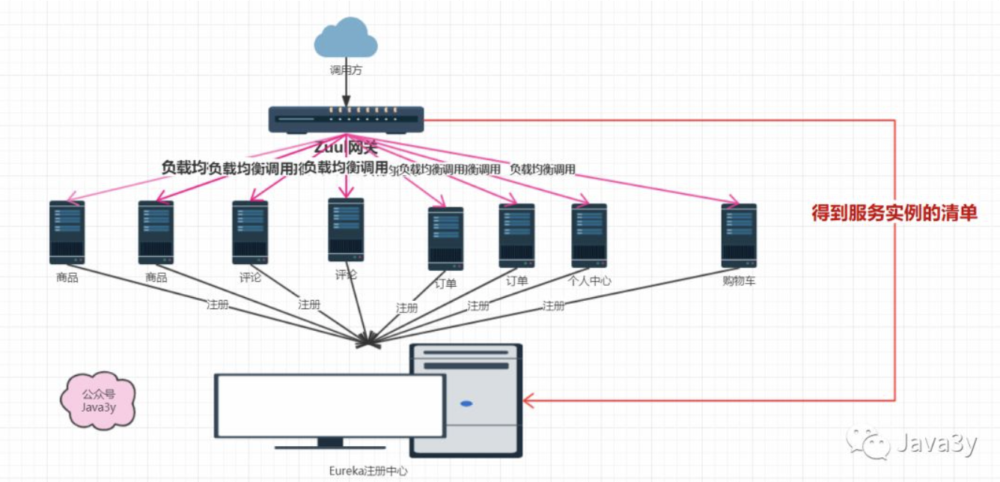

或者可以这样理解：

- zuul是对外暴露的唯一接口相当于路由的是controller的请求，而Ribbonhe和Fegin路由了service的请求
- zuul做最外层请求的负载均衡 ，而Ribbon和Fegin做的是系统内部各个微服务的service的调用的负载均衡

有了Zuul，还需要Nginx吗？他俩可以一起使用吗？

- 我的理解：Zuul和Nginx是可以一起使用的(毕竟我们的Zuul也是可以搭成集群来实现高可用的)，要不要一起使用得看架构的复杂度了(业务)~~~

  

## 6.SpringCloud Config

随着业务的扩展，我们的服务会越来越多，越来越多。每个服务都有自己的配置文件。

既然是配置文件，给我们配置的东西，那**难免会有些改动**的。

比如我们的Demo中，每个服务都写上**相同**的配置文件。万一我们有一天，配置文件中的密码需要更换了，那就得**三个都要重新更改**。

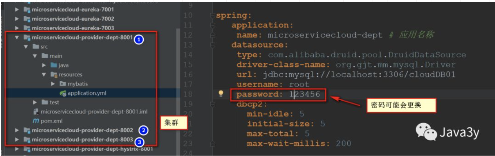

在分布式系统中，某一个基础服务信息变更，都**很可能**会引起一系列的更新和重启

Spring Cloud Config项目是一个解决分布式系统的配置管理方案。它包含了Client和Server两个部分，**server提供配置文件的存储、以接口的形式将配置文件的内容提供出去，client通过接口获取数据、并依据此数据初始化自己的应用**。

- 简单来说，使用Spring Cloud Config就是将配置文件放到**统一的位置管理**(比如GitHub)，客户端通过接口去获取这些配置文件。
- 在GitHub上修改了某个配置文件，应用加载的就是修改后的配置文件。
- 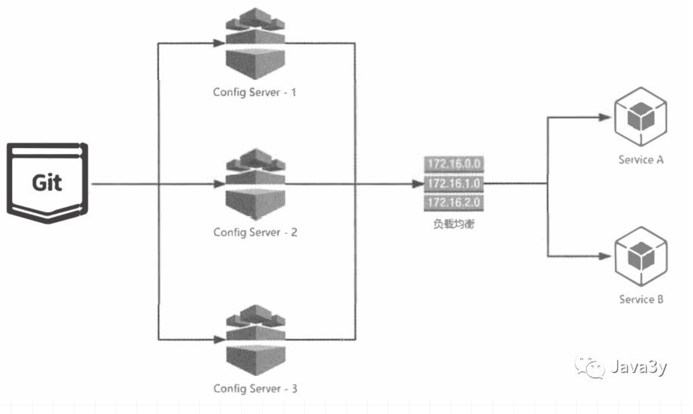

SpringCloud Config其他的知识：

- 在SpringCloud Config的服务端， 对于配置仓库的默认**实现采用了Git**，我们也可以配置SVN。
- 配置文件内的信息**加密和解密**
- 修改了配置文件，希望不用重启来**动态刷新配置**，配合Spring  Cloud Bus 使用~