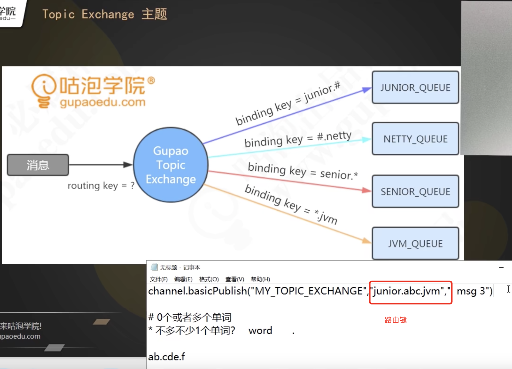
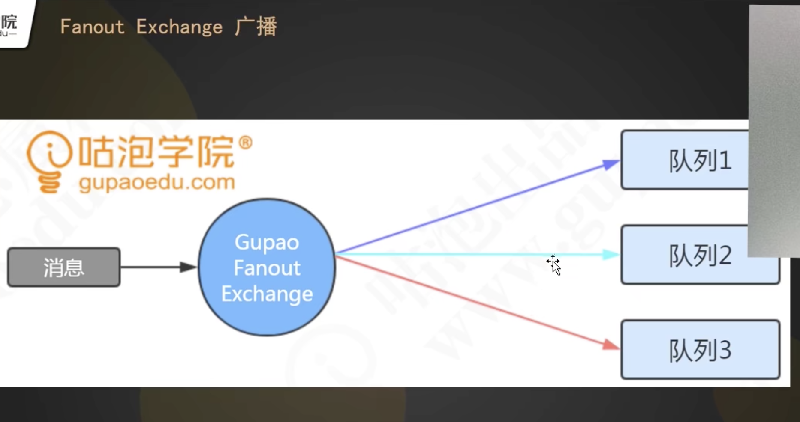

## RabbitMQ工作模型

交换机不是独立运行的服务，不会存储消息，可以理解为地址清单，我们发送的消息会携带一个标志，会根据交换机跟队列的绑定关系 ，决定路由到哪个队列上去。

#### 发送流程

生产者通过一个TCP长连接建立的虚拟连接channel（信道），把消息发送到交换机，交换机会根据消息的标志决定把消息路由到哪个队列上去，队列是真正用来存储消息的。

消费者会监听队列。

VHost 虚拟主机：提高资源利用率&命名冲突

#### 2.交换机类型

##### 1.直连类型交换机

##### 2.主题类型交换机

​	特点:队列跟交换机绑定的时候，绑定键可以带通配符。路由键只要符合了通配符的规则，就可以路由到相应的队列

##### 3.广播类型交换机

##### 4.如何选择交换机？

直连：精准

主题：过多业务线分级

广播：通用

3.